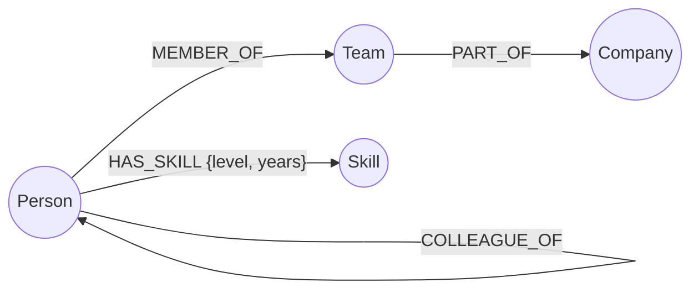

# Nexus — a skill-based colleague & mentor finder

Nexus answers a question every growing company struggles with: **"who around here actually knows X, and how do I reach them?"** It's built on top of [CognoDB](https://console.cognodb.com), a managed graph database, using the official Neo4j JavaScript driver over Bolt.

> Fictional company used for seed data: **Orbital Labs**, 30 people across 5 teams.

## Table of contents
- [Why a graph database?](#why-a-graph-database)
- [Data model](#data-model)
- [Features](#features)
- [Project structure](#project-structure)
- [Setup](#setup)
- [The main queries, explained](#the-main-queries-explained)
- [Screenshots](#screenshots)
- [Deployment](#deployment)

## Why a graph database?

The core question Nexus answers — **"who in my network, within N hops of colleagues, knows skill X?"** — is a **variable-length, direction-agnostic traversal combined with a filter**. In a relational schema this means a `people`, `skills`, `person_skills`, and a self-referential `colleague_of` join table, and then a recursive CTE (or N hand-written self-joins) just to walk two or three hops outward. The query gets slower and uglier with every extra hop, and "up to 3 hops, whichever is fewer" is awkward to express at all.

In CognoDB, the same question is one readable pattern:

```cypher
MATCH (start:Person {id: $personId})
MATCH path = (start)-[:COLLEAGUE_OF*1..3]-(holder:Person)
MATCH (holder)-[r:HAS_SKILL]->(s:Skill {name: $skillName})
RETURN holder, r.level, min(length(path)) AS hops
ORDER BY hops
```

Two more places the graph model pays for itself:
- **Shortest path between any two people** (`shortestPath(...)`) — a single native traversal, no bounded join depth to guess in advance.
- **Team skill gaps** — walking from a team to its members, and from *other* people to their expert-level skills, then anti-joining, is exactly the kind of "relationships between relationships" query that turns into a wall of SQL joins but stays a compact pattern in Cypher.

None of this requires denormalizing or maintaining a separate graph index on top of relational tables — the relationships (`HAS_SKILL`, `COLLEAGUE_OF`, `MEMBER_OF`) are first-class, queryable, and cheap to traverse in any direction.

## Data model



**Nodes**
| Label | Key properties |
|---|---|
| `Person` | `id`, `name`, `title`, `email`, `location`, `yearsExperience` |
| `Skill` | `name`, `category` |
| `Team` | `name` |
| `Company` | `name` |

**Relationships**
| Type | Direction | Properties | Meaning |
|---|---|---|---|
| `HAS_SKILL` | `Person → Skill` | `level` (beginner/intermediate/expert), `years` | This person has this skill |
| `COLLEAGUE_OF` | `Person ↔ Person` (undirected) | — | These two people know / have worked with each other |
| `MEMBER_OF` | `Person → Team` | — | Team membership |
| `PART_OF` | `Team → Company` | — | Org structure |

## Features

- **Find skill** — pick yourself and a skill; Nexus walks your colleague network (1–4 hops, adjustable) and ranks everyone who has that skill, closest first.
- **Connections** — pick any two people; Nexus traces the shortest chain of colleagues linking them.
- **People directory** — browse and search everyone, filter by name/team/skill.
- **Person profile** — full skill list, team, and direct colleagues, all clickable.

Every page has a loading state, an empty state, and an error state (including a global banner if CognoDB is unreachable).

## Project structure

```
nexus/
├── backend/
│   ├── src/
│   │   ├── db.js           # Neo4j driver setup + connection health check
│   │   ├── seedData.js     # raw seed data (people, skills, teams, edges)
│   │   ├── seed.js         # loads seedData.js into CognoDB
│   │   ├── queries.js      # every Cypher query, parameterised, in one place
│   │   └── server.js       # Express API routes
│   └── .env.example
└── frontend/
    ├── src/
    │   ├── pages/           # SkillFinder, Connections, People, PersonProfile
    │   ├── components/      # PersonCard, PersonPicker, SkillPicker, states
    │   ├── api.js           # fetch wrapper, one place all HTTP calls go through
    │   └── App.jsx
    └── .env.example (not needed - uses Vite proxy to backend)
```

## Setup

### 1. Create a CognoDB instance
1. Sign up at [console.cognodb.com](https://console.cognodb.com/signup) — no card needed for the free tier.
2. Create a free (`c0`) instance, pick a region, wait ~1 minute for it to provision.
3. Click **Connect** on your instance and copy the `bolt+s://...` URI and the generated password for user `cognodb` — the password is shown once.

### 2. Backend
```bash
cd backend
npm install
cp .env.example .env
# edit .env: paste your COGNODB_URI, COGNODB_USER=cognodb, COGNODB_PASSWORD
npm run seed     # loads 30 people, 23 skills, ~150 relationships
npm run dev      # starts the API on http://localhost:4000
```

### 3. Frontend
```bash
cd frontend
npm install
npm run dev      # starts on http://localhost:5173, proxies /api to :4000
```

Open `http://localhost:5173`.

## The main queries, explained

All queries live in `backend/src/queries.js`, fully parameterised (no string concatenation).

1. **`findSkillHoldersInNetwork`** — the headline query. Multi-hop (`1..N` `COLLEAGUE_OF`), direction-agnostic, joined to `HAS_SKILL`, deduplicated by shortest path length. Powers the "Find skill" page.
2. **`findConnectionPath`** — `shortestPath()` between two people over the colleague network. Powers the "Connections" page.
3. **`findTeamSkillGaps`** — aggregation across two disjoint sets of people (team members vs. everyone else) using `NOT EXISTS`, to find expert skills missing from a team.
4. **`getPersonProfile`** — one query, three `OPTIONAL MATCH`es, to assemble a full profile (team, company, all skills, all direct colleagues) in a single round trip.
5. **`findPeopleBySkill`** / **`listSkills`** / **`listPeople`** / **`searchPeopleByName`** — supporting one-hop queries for search and browsing.

## Screenshots

_Add screenshots here after running the app against your own CognoDB instance:_
- `docs/screenshot-skill-finder.png`
- `docs/screenshot-connections.png`
- `docs/screenshot-profile.png`

## Deployment

- **Backend**: any Node host (Render, Railway, Fly.io free tiers). Set `COGNODB_URI`, `COGNODB_USER`, `COGNODB_PASSWORD` as environment variables — never commit `.env`.
- **Frontend**: any static host (Vercel, Netlify). Set the API base URL to your deployed backend's URL (update `frontend/src/api.js`'s `BASE` constant, or set it via an env var and a small build-time replace).
- Keep your CognoDB instance running so the hosted demo stays live.

---
Built for the Wexa AI take-home assignment.
